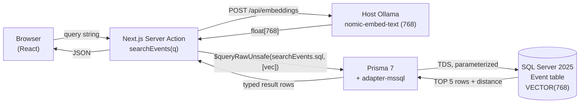

# TalkScout — Plan

## Overview

A semantic CFP finder. A speaker types a plain-English description of a talk; the app returns the upcoming conferences whose CFPs match by topic, ranked by semantic similarity. The whole stack runs on my Mac, end to end inside VS Code. No external vector store, no cloud embedding API, no API keys.

**Why this problem.** Existing conference listings index by date and region. None of them index by topical fit. As a speaker who decides where to submit based on whether the audience will care about my talk, that is the search I actually want. Every speaker I know describes the same friction.

**Shape of the answer.** One table in SQL Server 2025 holds both the relational metadata (slug, name, dates, topics, CFP window) and a native 768-dimensional vector column for the embedding. A Next.js Server Action embeds the user's query through host Ollama and runs a single ranked query through Prisma. Results stream back to the React page. Two embedded calls per search: one for the query (Ollama), one for the ranking (`VECTOR_DISTANCE` in T-SQL). No third process.

## Non-goals (v1)

- Authentication, user accounts, saved searches.
- Notifications or alerting when new CFPs match a saved query.
- A scraping/ingest pipeline. Events are seeded from a curated `data/events.json`. The pipeline is idempotent so re-ingest is cheap, but adding new events is a manual step.
- Editing event metadata from the UI.
- Multi-language UI or multi-language embedding. English only; `nomic-embed-text` is an English model.
- Production hardening (rate limiting, CSRF, observability). This is a demo app, not a service.
- A separate vector store, a separate embedding service, or any cloud account.

## Success criteria

Concrete and measurable, so I know when v1 is done:

1. From a clean clone, `npm run demo:reset && npm run dev` brings up a working app at `localhost:3000` in under 60 seconds (after Docker and Ollama are up).
2. A representative query — `agentic workflows for databases` — returns five ranked results in under 2 seconds end-to-end (browser to first paint).
3. For an out-of-vocabulary query, the top result is topically relevant even when no keyword from the query appears in the result's title or description.
4. The filter "CFP must be open right now" works correctly (no closed-CFP results when the filter is on).
5. Zero T-SQL string literals appear in any `.ts` or `.tsx` file.
6. The repo runs identically inside the dev container and on bare macOS.

## Architecture



Three processes total: the Next.js dev server (Node 22), host Ollama (Mac process with Metal acceleration), and the SQL Server 2025 container. The dev container reaches Ollama at `http://host.docker.internal:11434`. Prisma talks to SQL Server over TDS on port 14333.

The hot path is read-only from the database's perspective. Writes happen exclusively at seed time, never on a user request.

## Stack and rationale

| Layer | Choice | Why |
|---|---|---|
| Database | **SQL Server 2025**, native `VECTOR(N)` + `VECTOR_DISTANCE` | One database stores both relational rows and the vector. Eliminates the dual-store pattern (Postgres + Pinecone, MySQL + Qdrant, etc.) and the sync problem that comes with it. Vector type is supported on all SQL 2025 SKUs including the free Azure tier. |
| Embeddings | **Ollama on the host**, `nomic-embed-text` (768-dim) | Free, MIT-licensed, runs on Apple Silicon with Metal in under 200 ms per query. No API key, no quota, no data egress. Reproducible by anyone with a Mac. |
| ORM / driver | **Prisma 7** + `@prisma/adapter-mssql` | Typed bridge from TypeScript into SQL with first-class TypeScript inference on `$queryRawUnsafe<RowShape>` calls. Schema and migrations live in the repo. |
| SQL boundary | **All T-SQL in `prisma/sql/*.sql`**, loaded once at module load | Application code never holds a SQL string literal. Single canonical home for every query the app issues. Easier to grep, easier to review, easier to diff. |
| App framework | **Next.js 15** App Router + Server Actions | Server-side execution for the search (the embedding call and SQL stay off the client). Server Actions remove the need for a hand-written API route per query. |
| Runtime | **Node 22** (Bookworm slim) | Native `fetch`, native `crypto.createHash`, no transpile gymnastics. |
| UI styling | **Tailwind 4** | Utility-first; minimal CSS-in-JS overhead at build time. |
| Local dev | **Docker Compose + dev container** | Same SQL Server image every machine. Dev container provisions the Node toolchain and the MSSQL VS Code extension. Bare macOS works too. |

### Alternatives considered

**Postgres + pgvector.** Rejected because the demo audience (SQL Server developers) is the explicit target. The migration story from existing SQL Server apps to AI is the wedge.

**External vector store (Pinecone, Qdrant, Weaviate).** Rejected for the operational complexity and for the keyless-reproducibility constraint. Two processes is enough.

**Cloud embedding API (Azure OpenAI, OpenAI direct).** Rejected because it requires quota approval (Azure) or a paid API key (OpenAI). Either breaks the "anyone with a Mac can clone and run this" guarantee. Kept as an opt-in alternative path documented separately, not on the critical path.

**Prisma TypedSQL.** Would be the ideal SQL boundary mechanism, but TypedSQL does not support the `sqlserver` provider as of Prisma 7.x. The runtime SQL loader (`src/lib/sql.ts`) is the workaround.

## Data model

One table, `Event`. Relational columns for the bookkeeping plus a native vector column for the embedding.

```prisma
model Event {
  id              String                       @id @default(cuid())
  slug            String                       @unique
  name            String
  startDate       DateTime
  endDate         DateTime
  locationCity    String?
  locationCountry String?
  isVirtual       Boolean                      @default(false)
  topics          String                       @db.NVarChar(Max)
  description     String                       @db.NVarChar(Max)
  cfpOpenDate     DateTime?
  cfpCloseDate    DateTime?
  cfpUrl          String?
  contentHash     String                       @db.Char(64)
  embedding       Unsupported("VECTOR(768)")?
  ingestedAt      DateTime                     @default(now())
  updatedAt       DateTime                     @updatedAt

  @@map("Event")
}
```

| Field | Purpose | Notes |
|---|---|---|
| `id` | Primary key | `cuid()` (collision-resistant, time-sortable). Never displayed in the UI. |
| `slug` | Stable identifier for upsert | Derived from name + year. `MERGE` keys on this. |
| `name`, `startDate`, `endDate`, `locationCity`, `locationCountry`, `isVirtual` | Display metadata | |
| `topics` | JSON-as-string of topic tags | Stored as `NVARCHAR(MAX)` because SQL Server has no native string array type. Parsed on read. |
| `description` | Free-text description | Concatenated with `topics` to form the **embedding input**. The full description never goes to the client. |
| `cfpOpenDate`, `cfpCloseDate` | CFP submission window | Drives the "CFP open right now" filter in the search query. |
| `cfpUrl` | Outbound submission link | Shown as a button in the result card. |
| `contentHash` | SHA-256 of the natural fields | Lets the seed pipeline skip re-embedding on unchanged rows. |
| `embedding` | 768-float vector | Native `VECTOR(768)`. `Unsupported(...)` is how Prisma carries it through migrations; the actual `CAST(... AS VECTOR(768))` happens in T-SQL. |
| `ingestedAt`, `updatedAt` | Audit | `updatedAt` is touched by the `MERGE` only when the row actually changes. |

## Embedding strategy

**Model**: `nomic-embed-text` v1.5, 768 dimensions.

**Where it runs**: a host Ollama process on the Mac. Apple Silicon Metal acceleration is host-only — running Ollama inside a container drops to CPU and is ~5-10x slower. The dev container reaches it at `http://host.docker.internal:11434`.

**Why 768**: nomic-embed-text's native output. Sufficient for a corpus this size (~100 rows). No need for the higher-dimensional Matryoshka variants.

**Embedding input**: `"${topics}\n\n${description}"`. Concatenating the structured tag list with the prose description gives the model both the controlled vocabulary and the natural language form of the same content. The natural-language description carries semantic context the bare tag list lacks.

**When embeddings are produced**:
1. **Seed time** — every event's embedding is computed once and stored. The pipeline is content-hash gated so re-running on unchanged data is a no-op.
2. **Search time** — only the user's query is embedded. The stored event embeddings are reused.

**One model, one dimension, across the entire app.** No partial migrations, no mixed corpora.

## Seed pipeline

`prisma/seed.ts` is the single entry point. Reads `data/events.json`, embeds the new/changed rows, MERGEs into `Event`.

1. Read `data/events.json` (91 conferences, curated by hand).
2. For each event, compute `contentHash = sha256(slug + name + startDate + endDate + topics + description + cfpOpenDate + cfpCloseDate)`.
3. SELECT the current `(slug, contentHash)` pairs from `Event`. Skip embedding for any row whose hash is unchanged.
4. Batch the new/changed events through `embedBatch()` against host Ollama (`nomic-embed-text`, 768-dim). One float[768] per event.
5. `MERGE` into `Event` via `prisma/sql/upsertEvents.sql`. The MERGE casts the JSON-encoded embedding string to `VECTOR(768)` inside T-SQL.

**Idempotency**: re-running on unchanged data emits zero embedding calls and zero database writes. Re-running after an external edit to `events.json` re-embeds and re-writes only the changed rows.

**Demo reset**: `npm run demo:reset` truncates `Event`, re-runs migrations, and re-runs seed. Total time ~30 seconds on a warm Ollama.

## Search pipeline

A single Server Action, `searchEvents(query: string)`, in `src/app/actions.ts`. Marked `'use server'`. The only thing the client knows about.

**Request flow** (target budget per stage):

1. Browser sends the query string to the Server Action (~5 ms network on localhost).
2. Server embeds the query via host Ollama (~150-200 ms cold, ~50-100 ms warm).
3. Server runs `prisma/sql/searchEvents.sql` via `$queryRawUnsafe<EventRow>` with the query vector and a `TOP 5` limit (~50 ms).
4. Result rows return to the client. React re-renders (~50 ms first paint).

**Total budget**: ≤2 seconds wall-clock, end-to-end. Typical observed: ~400 ms warm.

**SQL shape**:

```sql
-- prisma/sql/searchEvents.sql (v1, no filter yet)
SELECT TOP 5
    slug, name, startDate, endDate,
    locationCity, locationCountry, isVirtual,
    topics, description,
    cfpOpenDate, cfpCloseDate, cfpUrl,
    VECTOR_DISTANCE('cosine', embedding, CAST(@P1 AS VECTOR(768))) AS distance
FROM Event
WHERE embedding IS NOT NULL
ORDER BY distance ASC;
```

`VECTOR_DISTANCE` returns smaller-is-closer for cosine. Ranking by distance ascending gives the top-K nearest neighbors.

**v1 deliberately omits the CFP-window filter.** The demo flow surfaces that gap on stage and fixes it live (see "Open issues" below).

## UI plan (what's left to build)

The data layer is done. The UI is the remaining work, and the only piece I want delivered agentically.

**Page**: `src/app/page.tsx` (client component). Manages a single piece of state (the result list) and a callback (search submit). Replaces the current placeholder paragraph.

**Components**:

| Component | File | Responsibility |
|---|---|---|
| `SearchInput` | `src/components/search-input.tsx` | Controlled text input with a placeholder cycling through sample queries every 4s. Submits on Enter. |
| `EventCard` | `src/components/event-card.tsx` | One result row. Name, dates, location, topic chips, CFP status pill, "Submit a talk" outbound button. |
| `CfpStatusPill` | `src/components/cfp-status-pill.tsx` | Five visual states keyed by today vs `cfpOpenDate`/`cfpCloseDate`: open, opens-soon, closes-soon, closed, unknown. |

**Helpers**:

| Helper | File | Responsibility |
|---|---|---|
| `searchEvents` | `src/app/actions.ts` | The Server Action. `'use server'`. Embeds the query and calls the SQL. |
| `cfpStatus(today, open, close)` | `src/lib/cfp-status.ts` | Pure function returning one of the five status enum values. Unit-testable. |
| Types | `src/lib/types.ts` | `EventRow`, `CfpStatus`. Non-async exports cannot live in a `'use server'` file. |

**States**: empty (default), loading (skeleton cards while the action is pending), results (one to five `EventCard`s), no-results (empty-state copy).

## SQL boundary

The rule: all T-SQL lives in `prisma/sql/*.sql`. Application TypeScript imports SQL files as string constants from `src/lib/sql.ts`, which reads the files once at module load.

```ts
// src/lib/sql.ts
import { readFileSync } from 'node:fs'
import { resolve } from 'node:path'

const SQL_DIR = resolve(process.cwd(), 'prisma/sql')
const load = (f: string) => readFileSync(resolve(SQL_DIR, f), 'utf8')

export const SEARCH_EVENTS_SQL = load('searchEvents.sql')
export const UPSERT_EVENTS_SQL = load('upsertEvents.sql')
```

Application code passes those constants to `prisma.$queryRawUnsafe<RowShape>` / `$executeRawUnsafe` with bound parameters. No T-SQL anywhere in `.ts` files.

**Why not Prisma TypedSQL?** TypedSQL does not support the `sqlserver` provider as of Prisma 7.x. The load-at-startup pattern is the SQL Server workaround. When TypedSQL ships sqlserver support, swap.

## Constraints (the project's hard rules)

These are also encoded in `openspec/config.yaml` so any agent working on this repo honors them.

1. **All T-SQL in `prisma/sql/*.sql`.** Never in `.ts`. Never as a template literal at the call site.
2. **Embeddings produced in Node.** No `OPENAI` extension, no in-T-SQL embedding calls, no embedding-on-write triggers.
3. **Container resource caps**: SQL Server container is capped at 2 GB memory and 2 CPUs. No other limits are needed for the demo workload.
4. **`'use server'` files export only async functions.** Types, schemas, and constants live in `src/lib/types.ts`. Next.js's Server Actions build will reject anything else.
5. **No backwards-compatibility shims.** This is a new project. If something changes, it changes everywhere in one diff.
6. **One model, one dimension.** Mixing `nomic-embed-text` and Azure OpenAI in the same database is forbidden. Switching providers means a fresh database.

## Risks and mitigations

| Risk | Mitigation |
|---|---|
| Prisma TypedSQL doesn't support `sqlserver` | Use the runtime SQL loader in `src/lib/sql.ts` until TypedSQL adds support. |
| Ollama cold-start adds latency on first search | Pre-warm by hitting `/` once before recording. Acceptable in demo conditions; in a real deploy, run Ollama as a sidecar with a readiness probe. |
| `nomic-embed-text` is English-only | Documented as an explicit non-goal for v1. Multilingual support would require a different model + a fresh DB. |
| SQL Server container OOM under default 2 GB cap | Cap is sufficient for ~100-row corpus with a single concurrent client. If the cap is hit, raise to 4 GB; not expected. |
| `Unsupported("VECTOR(768)")` in Prisma may regress | Watch Prisma 7.x changelog; if the type lands as first-class, swap and remove the workaround. |
| Tailwind v4 hot-reload occasionally drops styles after a many-file generation | Manual restart (`Ctrl+C` → `rm -rf .next` → `npm run dev`) recovers in 5 seconds. Documented in the demo runbook. |

## Open issues (to be discovered on stage)

**The CFP-window filter is missing in v1.** A speaker doesn't want results for CFPs that are already closed. The current `searchEvents.sql` returns the top five regardless of CFP state. Fix: add `cfpOpenDate <= GETDATE() AND cfpCloseDate >= GETDATE()` to the `WHERE` clause. Trivial change. Deliberately left out of v1 so the demo can surface it live and fix it with an agent on the SQL file.

**The MSSQL extension Schema Designer is a useful visual artifact.** When the audience asks "is the vector column really in the same row as the relational columns?", the Schema Designer answers visually. Show it once per demo.

## Dev environment

**Three host prerequisites**:

1. Docker (or OrbStack) — for the SQL Server container.
2. Ollama — for the embedding model. `ollama pull nomic-embed-text` once.
3. Node 22 — if running outside the dev container.

**Two paths**:

- **Dev container** (recommended): VS Code's "Reopen in Container" provisions Node 22, Prisma CLI, the MSSQL VS Code extension, and the Markdown Mermaid preview extension. The dev container reaches the SQL Server container on the host's Docker daemon by name (`talkscout-mssql`) over the shared `talkscout_default` network. Ollama is reached at `host.docker.internal:11434`.
- **Bare macOS**: `npm install && docker compose up -d && npx prisma migrate deploy && npm run db:seed && npm run dev`. About 90 seconds cold.

**Repro contract**: from a clean clone, `npm run demo:reset && npm run dev` brings the placeholder app to `localhost:3000` in under 60 seconds, with the database seeded and ready for the first search.

## Out-of-scope for this document

Deployment, observability, CI, security, scaling. This is a single-developer demo app running locally on a Mac. Cloud deployment is its own change proposal, tracked separately.
