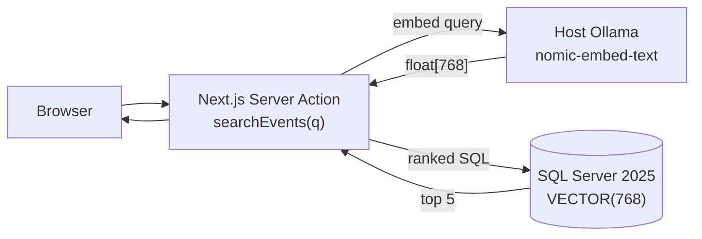

# TalkScout — Plan

A semantic CFP finder. A speaker types a plain-English description of a talk; the app returns the upcoming conferences whose CFP topics match, ranked by similarity. End to end on my Mac, inside VS Code. No external vector store, no cloud embedding API, no API keys.

## Architecture



Three processes: Next.js dev server, host Ollama (Metal accelerated), SQL Server 2025 container. The hot path is read-only.

## Stack

| Layer | Choice | Why |
|---|---|---|
| Database | SQL Server 2025 — native `VECTOR(768)` + `VECTOR_DISTANCE` | One DB for relational + vector. No external store. |
| Embeddings | Ollama, `nomic-embed-text` (768-dim) | Free, no API key, Metal-accelerated on Mac. |
| ORM | Prisma 7 + `@prisma/adapter-mssql` | Typed bridge from TS to SQL. |
| SQL boundary | All T-SQL in `prisma/sql/*.sql`, loaded at module load | No SQL string literals in `.ts` files. |
| UI | Next.js 15 Server Action + React components | Server-side embedding + SQL, off the client. |

## Data model

One table, `Event`. Relational columns plus a native vector column.

```prisma
model Event {
  id           String   @id @default(cuid())
  slug         String   @unique
  name         String
  startDate    DateTime
  endDate      DateTime
  topics       String   @db.NVarChar(Max)
  description  String   @db.NVarChar(Max)
  cfpOpenDate  DateTime?
  cfpCloseDate DateTime?
  cfpUrl       String?
  contentHash  String   @db.Char(64)
  embedding    Unsupported("VECTOR(768)")?
}
```

`Unsupported("VECTOR(768)")` carries the column through migrations. The `CAST(... AS VECTOR(768))` happens in T-SQL.

## Seed (done)

1. Read `data/events.json` (91 conferences, curated).
2. Content-hash each row; skip embedding if unchanged.
3. Batch through Ollama (`embedBatch()`, 768-dim).
4. `MERGE` via `prisma/sql/upsertEvents.sql`.

Re-runs on unchanged data are no-ops.

## Search (done)

`searchEvents(query)` Server Action:

1. Embed the query via Ollama.
2. Run `prisma/sql/searchEvents.sql` with the vector and `TOP 5`.
3. Return the ranked rows.

```sql
SELECT TOP 5 slug, name, startDate, endDate, topics, description,
       cfpOpenDate, cfpCloseDate, cfpUrl,
       VECTOR_DISTANCE('cosine', embedding, CAST(@P1 AS VECTOR(768))) AS distance
FROM Event
WHERE embedding IS NOT NULL
ORDER BY distance ASC;
```

## UI (NOT DONE — to build next)

| Component | File | Responsibility |
|---|---|---|
| `SearchInput` | `src/components/search-input.tsx` | Input + Enter to submit. Placeholder cycles through example queries. |
| `EventCard` | `src/components/event-card.tsx` | One result row: name, dates, topics, CFP pill, submit button. |
| `CfpStatusPill` | `src/components/cfp-status-pill.tsx` | Five states from `(today, cfpOpenDate, cfpCloseDate)`. |
| `cfpStatus()` | `src/lib/cfp-status.ts` | Pure function, unit-testable. |
| `page.tsx` | `src/app/page.tsx` | Wire it all together. Replace the placeholder. |

## Constraints

- All T-SQL in `prisma/sql/*.sql`. Never as a string literal in TypeScript.
- Embeddings produced in Node, not T-SQL.
- `'use server'` files export only async functions. Types in `src/lib/types.ts`.
- One embedding model and one dimension across the whole app.
- SQL Server container capped at 2 GB / 2 CPUs.

## Open issue

**The CFP-window filter is missing.** A speaker does not want results for CFPs that are already closed. Fix: add `AND cfpOpenDate <= GETDATE() AND cfpCloseDate >= GETDATE()` to `searchEvents.sql`. Deliberately deferred so the gap is discovered live during the first search.
