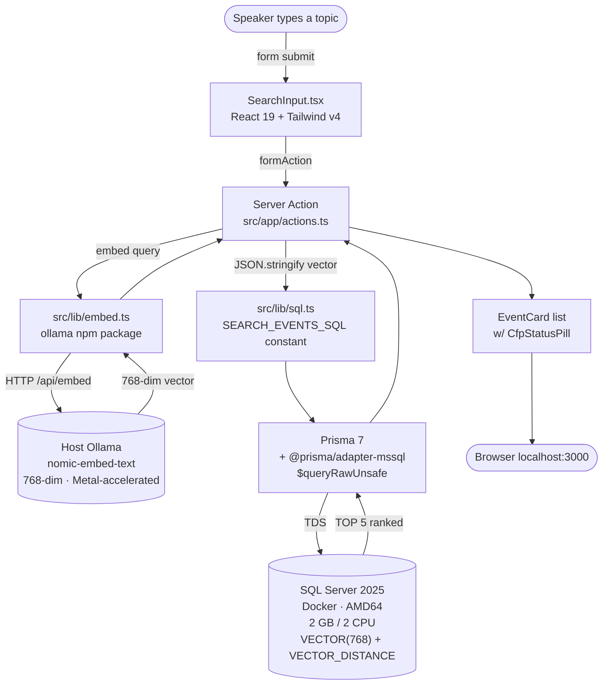
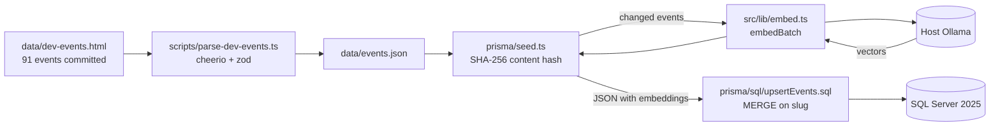
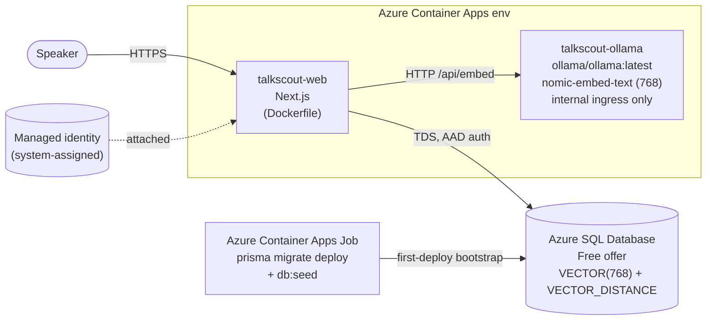

# TalkScout Architecture

## What this stack gives you

A semantic-search application end-to-end inside VS Code, with no separate vector database, no cloud embedding API, and no SQL string literals in TypeScript. Five tools, each doing exactly one job, composed so a developer can go from "I want a CFP finder" to "it ranks events by topic in 3 seconds" without leaving the editor.

## The five tools and what they do here

| Tool | Job in this project | Why it earns its place |
|---|---|---|
| **SQL Server 2025** | Stores 91 conferences with their 768-dim embeddings as native `VECTOR(768)` columns; ranks queries with `VECTOR_DISTANCE('cosine', ...)` at search time | One database for relational + vector data. No Pinecone/Qdrant + Postgres dual setup. No syncing two stores. |
| **Ollama** (host) | Generates 768-dim embeddings via `nomic-embed-text` for both seed-time content and search-time queries | Local, free, no API keys, no data egress. Metal-accelerated on Apple Silicon. The audience can clone and run with zero cloud accounts. |
| **Prisma 7** | Migrations, the `Event` model, and a typed bridge from TS to SQL via `$queryRawUnsafe(SQL_CONSTANT, ...)` plus the `@prisma/adapter-mssql` driver | Schema-as-code. The `.sql` files stay the only place T-SQL lives; the call site in TypeScript reads as one line. |
| **MSSQL VS Code extension** | Connection management, query editor, results grid, Schema Designer | Inspect data without leaving the IDE. Lets you SELECT against the `VECTOR(768)` column live and see embeddings sitting alongside relational rows. |
| **GitHub Copilot + OpenSpec** | `/opsx-propose` generates a change proposal from plain English; `/opsx-apply` writes the code | Spec-driven. Requirements are reviewable artifacts on disk, not chat history. The agent honors the architectural rules in `openspec/config.yaml`. |

## Search hot path (every user query)

## Seed-time ingest path (off the hot path)

## Architectural rules (cross-reference)

The non-negotiable rules driving this architecture are documented in `openspec/config.yaml` under "Architectural rules". Summary:

- **All T-SQL lives only in `prisma/sql/`** (two files: `searchEvents.sql`, `upsertEvents.sql`). Loaded as string constants by `src/lib/sql.ts` and invoked via `prisma.$queryRawUnsafe` / `$executeRawUnsafe`.
- **Embeddings are produced in Node**, not in T-SQL. We do not use `CREATE EXTERNAL MODEL`, `AI_GENERATE_EMBEDDINGS`, or `AI_GENERATE_CHUNKS`.
- **SQL Server container** is capped at 2 GB memory and 2 CPUs; runs `platform: linux/amd64` on Apple Silicon via Rosetta.
- **Ollama runs on the host**, not in a container, for Metal acceleration. The dev container is the one exception (Ollama-as-feature inside the workspace container for repro convenience).
- **Prisma 7 with `@prisma/adapter-mssql`**: connection URL declared in `prisma.config.ts` (Migrate) and constructed at runtime via the adapter (PrismaClient).

## Cloud architecture

When deployed to Azure via the `add-azure-deployment` change, the topology shifts hosts but the code, model, and schema dimension are identical to local development. The same Prisma migrations apply to both environments, and the same Ollama model serves embeddings in both. Only `OLLAMA_HOST` and `DATABASE_URL` change.

| Layer | Local | Azure |
|---|---|---|
| Compute | Next.js dev server in dev container | Azure Container Apps consumption tier, single web revision |
| Embeddings host | Host Ollama (Metal-accelerated) | Sibling Container App `talkscout-ollama` running `ollama/ollama:latest` (CPU) |
| Embedding model | `nomic-embed-text` (768-dim) | `nomic-embed-text` (768-dim) — identical |
| Database | SQL Server 2025 container, `VECTOR(768)` | Azure SQL Database free offer, `VECTOR(768)` |
| Secrets | `.env` (gitignored) for the local demo password | Managed identity for app to DB; no app-side secrets on the deployed revision |
| Cost | Local Docker | $0 on the Azure free offer + ACA consumption grant |

Architectural invariants preserved across local and Azure:

- All T-SQL still lives in `prisma/sql/`. Dimension is constant at 768, so no templating is required.
- Embedding is produced in Node via the same dispatcher (`src/lib/embed.ts`), calling the same `nomic-embed-text` model. Only `OLLAMA_HOST` differs.
- Same Prisma migrations run in both environments.
- The `microsoft/azure-skills` plugin is the deployment driver. It is declared as task 0 in the change's `tasks.md`, not vendored in the repo.

Alternatives considered:

- **Azure App Service F1 / Azure Static Web Apps for hosting**: both have free tiers but neither cleanly hosts the Ollama sidecar in the same environment with internal-only DNS by service name. ACA was selected.
- **Azure OpenAI for embeddings**: requires quota approval, which blocks first-time-audience reproducibility. Retained as an opt-in path via `EMBEDDING_PROVIDER=azure-openai`; users opting in must accept a fresh 1536-dim database.

## Data model

See `prisma/schema.prisma`. The single `Event` model has a `VECTOR(768)` column declared as `Unsupported("VECTOR(768)")` so Prisma can migrate the table while keeping the column out of the generated client surface (we read/write it via the SQL files only). The dimension is identical local and cloud.
